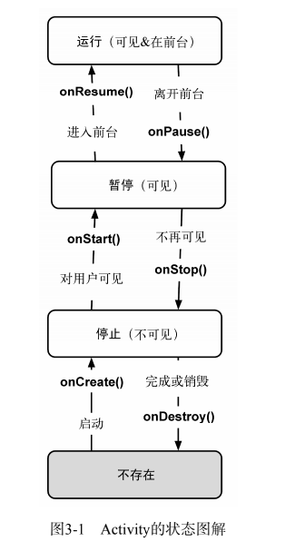
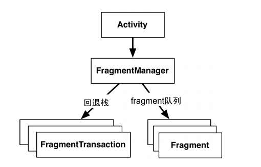

# Android编程指南入门学习笔记：

## 第一章：

- 新建android项目，修改xml文件-修改项目的控件
- layout中的xml引用values文件夹中的strings.xml，通过"@string/false_button"
- android studio Session 'app': Error Installing APK解决方法
  - 尝试Build -> Clean Project再编译。
- 在activity中引用已经xml生成的组件：public View findViewById(int id)
- android 应用属于典型的事件驱动类型：
  - 使用匿名内部类来实例化监听器，监听器是首先特定监听器接口的对象
- Android的toast
是用来通知用户的简短弹出消息，用户无需输入或进行任何操作。

Gradle编译android项目：

1. 进入项目目录
2. ./gradlew tasks //编译项目
3. ./gradlew installDebug // 安装项目到当前连接的设备上

## 第二章 andoriod 与MVC设计模式：

- 配置android项目，修改变量前缀识别，在codeStyle CodeGeneration中
- 资源，通过java R类去找到，返回的id 是一个int类型的数据
- 在控制器中，找String资源，使用R.string.xx 找视图的话， 使用findViewById（R.id.视图id）（记得cast to 视图的类型）


- 为控制应用包的大小，我们可以只为主流设备准备分辨率较高的定制图片资源。至于那些不常见的低分辨率设备，让Android系统自动适配就好。

- 向应用中添加图片：
  - 建立不同像素率的文件夹，将不同像素的图片，放到不同的文件夹中去。图省事，可以只放高像素的图片。
  - 注意点：图片后缀为：.jpg .png .gif 能够自动获得资源id，（注意，文件名必须是小写字母且不能有任何空格符号。）
- 挑战练习：为 TextView 添加监听器

## 第三章 项目的生命周期以及设备旋转

- andoriod 应用的生命周期：




- Log.d()// debug 日志输入，前面是


```java
// 周期函数：
    @Override
    public void onStart() {
        super.onStart();
        Log.d(TAG, "onStart() called");
    }
    @Override
    public void onPause() {
        super.onPause();
        Log.d(TAG, "onPause() called");
    }
    @Override
    public void onResume() {
        super.onResume();
        Log.d(TAG, "onResume() called");
    }
    @Override
    public void onStop() {
        super.onStop();
        Log.d(TAG, "onStop() called");
    }
    @Override
    public void onDestroy() {
        super.onDestroy();
        Log.d(TAG, "onDestroy() called");
    }
```

- LogCat右上角添加过滤器，来查看tag的打印消息

- 在应用程序的设备配置发生改变，andorid就会销毁掉当前的activity，然后创建新的activity，比如：键盘，语言的改变，旋转屏幕。
- 在旋转之后，或者是暂时退出应用，使用protected void onSaveInstanceState(Bundle outState)保存当前的数据，或者进入暂存状态，（在后台，但是没有被销毁）会自动执行上面的函数。所以覆盖实现，在这个函数中存储数据到Boundle中去。
- **取出呢？**

- 各种日志记录级别：


## 第四章 android应用的调试：

- LogCat查看日志：
- 记录栈跟踪的诊断性日志：在日志输出函数的函数，第三个参数新建一个 EXception（）
- 利用调试器设置断点调试
- 异常断点：就是使用断点来捕获异常，需要在View BreaKpoints 设置异常断点。当有某一个异常发生的时候，就当作断点处理。
- Android Lint：是Android应用代码的静态分析器。 Analyze Inspect Code运行 Lint
- 清理项目：Build Clean Project菜单项。

## 第五章：第二个activity

- 新建String文件，键值对
- 新建一个CheatActivity
- 新建布局的xml

- Android Studio的快速打开文件功能：使用
Command+Shift+O（或Ctrl+Shift+N）快捷键，呼出快速打开对话框，利用提示功能或直接输入
目标文件名，按Return（或Enter）键打开
- 新建btn，然后在btn添加点击事件来新建一个activity
- activity调用startActivity(...)方法时，调用请求实
际发给了操作系统。通过传入intent 参数来指定开始哪一个activity
- 在启动activity前，ActivityManager会检查确认指定的Class是否已在配置文件中声明。如已完成声明，则启动activity，应用正常运行。反之，则抛出ActivityNotFoundException异常，可能会导致应用崩溃。这就是我们必须在manifest配置文件中声明应用全部activity的原因所在。
- 显示intent和隐式intent
  - 一个应用的activity如需启动另一个应用的activity，可通过创建隐式intent来处理

- activity 间的数据传递：
  - 给子activity传递数据：通过使用使用 intent extra，附在Intent一起带过去 intent.putExtra
  - 使用boolean getBooleanExtra(String name, boolean defaultValue)//获得 name建所对应值```mAnswerIsTrue=getIntent().getBooleanExtra(EXTRA_ANSWER_IS_TRUE,false);```
  - 子activity返回数据给之前的activity：
  - 点击的时候，给父activity传值：new Intent（）、putExtra(key,value),setResult(return_OK,intent)
  - 父activity通过重写protected void onActivityResult(int requestCode, int resultCode, Intent data)，判断requestCode来看是哪个之界面返回的，resltCode看返回是否成功，Intent中找到返回到父Activity的键值对。
- Activity.finish()//可以将QuizActivity从栈里面弹出
- 不局限于单个应用，回退栈作为一个整体共享给操作系统及设备使用

## 第六章：Android SDK版本与兼容

- SDK 最低版本
  - 最低版本设置值为标准，操作系统会拒绝将应用安装在系统版本低于标准的设备上。
- SDK 目标版本：
  - 应用是设计给哪个API级别去运行的。大多数情况下，目标版本即最新发布的Android版本
  - 如果新发布的SDK版本会改变应用在设备上的显示方式，甚至连后台操作系统运行也会受到影响。
  - 要么修改应用去适应新版本系统，要么降低SDK目标版本。降低SDK目标版本可以保证的是，即便在高于目标版本的设备上，应用仍然可以正常运行，且运行行为仍和目标版本保持一致。这是因为新发布版本中的变化已被忽略。
- SDK 编译版本：
  - 在编译代码时，SDK编译版本或编译目标指定具体要使用的系统版本。Android Studio在寻找类包导入语句中的类和方法时，编译目标确定具体的基准系统版本。
- 可以通过在官方文档上，查看api在哪个sdk版本是适用的。
- Build.VERSION.SDK_INT //当前设备使用的api版本

## 第七章：UI fragment与fragment管理器

- fragment是一种控制器对象，activity可委派它完成一些任务。这些任务通常就是管理用户界面。受管的用户界面可以是一整屏或是整屏的一部分。
- 管理用户界面的fragment又称为UI fragment。它自己也有产生于布局文件的视图。fragment视图包含了用户可以交互的可视化UI元素。
- activity视图可预留供fragment视图插入的位置。如果有多个fragment要插入，activity视图也可提供多个位置。
- 在activity中使用 fragment，fragment是一个控制器，也可以绑定对应的布局xml
- 使用支持库来使用fragment而不是使用android sdk 自带的fragment，能够更好的兼容低版本的api，也便于更新 新的 support fragment
- Android stodio 添加依赖，File->Project Structure 添加需要的依赖
- support-v4库，已经整合到andoridx中了
- mainActivity 继承 Fragment而不是之前的AppCompatActivity

activity 托管 UI Fragment 两种方式
- 布局中添加Fragment
  - 这种方式简单但不够灵活。在activity布局中添加fragment，就等同于将fragment及其视图与activity的视图绑定在一起，并且在activity的生命周期过程中，无法切换fragment视图。
- 在代码中添加Fragment
  - 式比较复杂，但也是唯一可以在运行时控制fragment的方式。我们自行决定何时添加fragment以及随后可以完成何种具体任务；也可以移除fragment，用其他fragment代替当前fragment，然后重新添加已移除的fragment。
- 定义acitivity中的容器视图，一个xml可以找到 FrameLayout可以通过id在代码中找到
- 定义Fragment的布局 新建一个fragment_crime.xml 一个LinearLayout包括者一个EditText
  - EditText hint属性，可以放placeholder
- 创建Fragment类，注意使用的依赖。实现onCreate（)方法
  - 实例化视图，是在onCreateView（）中进行的，重写这个方法，并且指定返回的视图由哪一个xml文件生成
  - 在返回了View之后，通过view找到xml文件中的对象，找到之后设置监听方法
- 将Fragmentent添加到activiey，就可以显示出来了。
  - 引用fragmentManager进行fragment 的管理。
 


``` java
FragmentManager fm = getSupportFragmentManager(); 
 Fragment fragment = fm.findFragmentById(R.id.fragment_container); 
 if (fragment == null) { 
 fragment = new CrimeFragment(); 
 fm.beginTransaction() // 开始一个事务，添加 fragment
 .add(R.id.fragment_container, fragment) 
 .commit(); 
 } 
 }
```
 

 - 使用容器视图资源ID去识别UI fragment是FragmentManager的内部实现机制。 如果要向activity添加多个fragment，通常需要分别为每个fragment创建不同ID的容器。一个容器对应着一个fragment
 - activity的FragmentManager负责调用队列中fragment的生命周期方法。添加fragment供FragmentManager管理时，onAttach(Activity)、onCreate(Bundle)以及onCreateView(...)方法会被调用。
 
 保持fragment 与 activity 的状态一致。

- 一个良好的使用原则是：应用单屏至多使用2～3个fragment

## 第八章：使用布局与组件创建用户界面

- java里面是自己有UUId和Date对象的，直接new
- CheckBox(单击打勾控件)，setOnCheckedChangeListener

```java
mSolvedCheckBox.setOnCheckedChangeListener(new OnCheckedChangeListener() {
 @Override
 public void onCheckedChanged(CompoundButton buttonView, boolean isChecked) {
 // Set the crime's solved property
 mCrime.setSolved(isChecked);
 }
});
```

- 样式，(style) 一系列属性的集合
  - 创建自己的样式文件。具体做法是将属性定义添加并保存在res/values/目录下的样式文件中，然后在布局文件中以@style/my_own_style（样式文件名的形式引用
- 主题是各种样式的集合
- dp、sp以及屏幕像素：
  - dp在不同的屏幕密度上都是都是一样大的
  - sp与上面一样，但是像素会受用户字体偏好设置的影响。我们通常会使用sp来设置屏幕上的字体大小
  - text size 文字的像素高度
  - margin 视图组件间的距离
  - padding 内边距 视图外边框与其内容间的距离。
- 布局参数：
  - 不以layout_开头的属性作用于组件。组件实例化时，会调用某个方法按照属性及属性值进行自我配置。
  - 以layout_开头的属性则作用于组件的父组件。我们将这些属性统称为布局参数。它们会告诉父布局如何在内部安排自己的子元素
- 可以通过图形界面设计ui的时候快速设计landscape的ui视图，默认会复制之前的xml
  - 使用图形界面来编辑属性（还不错）
  - layout_weight:这个属性在宽（高）之后再进行作用，将空白区域按照比例来分配
  - 如果想直接按照比例，可以先把width 设置为0dp
  - 如果一个组件只存在于一个布局上，则应先在代码中进行空值检查，确认当前方向的组件存在，再调用相关方法：

```java
Button landscapeOnlyButton = (Button)v.findViewById(R.id.landscapeOnlyButton); 
if (landscapeOnlyButton != null) { 
 // Set it up 
}

```

- 定义在水平或竖直布局文件里的同一组件必须具有同样的android:id属性，这样代码才能引用到它。
- 使用DateFormat来格式化日期： 
`String date = (String) DateFormat.format("EEEE, MMMM dd, yyyy", mCrime.getDate());`


