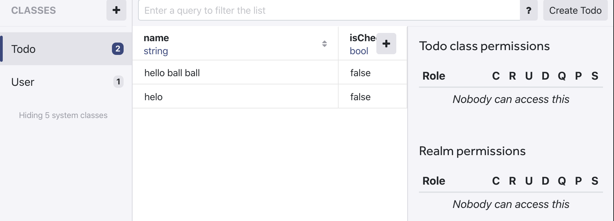

# lebus教程04

## p67-75:本地储存coredata 和 realm

- 介绍cs/bs架构
- cs不需要大量的网络连接，提高软件的使用体验。
- 本地存储三种方法：
  1. userdefaults
  2. core data -- apple 自带的，代码较多，速度不够快--不推荐
  3. realm-移动端数据库 推荐
- core data的使用： 
- 新建一个项目，use core data 点进去，看看代码，文件目录发生了什么改变
- 添加模型文件，添加模型里面的实体，添加字段。
- 修改原来的代码，import Core data，添加一些系统生成的方法（修改model的名字）；
- 系统自动要使用它的模型文件（系统不识别就报错了）
- 实例类的方法 改变，sava的方法直接应用 appdelegate文件中的即可。

``` swift
// core data select数据：
do{
    todos = try context.fetch(Todo.fetchRequest())
}catch{
    print(error)
}
// 删除
context.delete(todos[indexPath.row])

// 其他的操作，记得save 数据即可

```

- p70 realm 第三方数据库：
- 使用cocopod 安装Realm（失败了，
- 我发现 cocopod客户端安装之后，默认使用cdn那个源，不使用github那个源，
- 所有我删掉原来的库，准备重写下载一个，基本上下不动，所以我试了老师博客上几种方法，
- 在github上下载zip也下不到，最后找到自己原来下载的zip，配置好之后还是不能用，默认地址还是cdn那个，所以换个思路还是使用命令行来安装，使用清华源来安装realm
- 清华镜像源网站：**https://mirrors.tuna.tsinghua.edu.cn/help/CocoaPods/**

```shell
# 执行下面命令
$ cd ~/.cocoapods/repos 
$ pod repo remove master
$ git clone https://mirrors.tuna.tsinghua.edu.cn/git/CocoaPods/Specs.git master
#podfile 文件添加下面一行
#source 'https://mirrors.tuna.tsinghua.edu.cn/git/CocoaPods/Specs.git'
```


- 练习realm 的基础使用：

``` swift
 let user = User()
        user.name = "Fido"
        user.age = 15
        
        do {
            let realm = try Realm()
            
            try realm.write {
                realm.add(user)
                }
        }catch{
            print(error)
        }
        // 输出默认数据库文件源,it can use realm studio to look the database
        print(Realm.Configuration.defaultConfiguration.fileURL)
```

- p71 Realm增数据：
- 在原有的todo项目中，使用realm，创建Todo对象，继承object，写上属性
- 然后在全局变量中实例化，实例化完之后在sava方法中进行数据的添加
- 强制 try，（try！）确定此操作一定可以成功

```swift
// user realm create object:
class Todo: Object {
    @objc dynamic var name = " "
    @objc dynamic var isChecked = false
}
//create realm object and use try! if you confirm will ok
let realm = try! Realm()
// add new data to realm database
       do {
            try realm.write {
                realm.add(todo)
                        }
        } catch  {
            print(error)
        }
```




- realm select data
- realm.object 获取到 result<>
- 修改todos 变量的数据类型
- 可选值若不存在，设置默认值  ？？ 1
- 在add行的函数里面，使用tableview reload data

```swift
// realm 取数据：
        todos = realm.objects(Todo.self)

// change todo datatype
var todos:Results<Todo>?
//sava data , reload views
 let todo = Todo()
        todo.name = name
//        todos.append(todo)
        saveData(todo: todo)//存储新增数据，模型里面的数据也增加了
  
        tableView.reloadData() //重新执行渲染table方法,call tableview cell ForRowAt 方法
```

- realm change data
  - 在realm写方法中修改todo某一个对象的值
  - 注意要使用do-catch包含代码段，不然可能出错。
  - 点击修改isChecked 类似
  - 然后记得reload tableView即可

```swift
// 修改数据，重新渲染加载数据：
        do {
            try realm.write {
                todos![editRow!].name = name
            }
        } catch {
            print(error)
        }
        tableView.reloadData()
// table 点击函数中：
 override func tableView(_ tableView: UITableView, didSelectRowAt indexPath: IndexPath) {
        if !isEditing{
            if let todos = todos
                // change data all model and database
                do {
                    try realm.write {
                        todos[indexPath.row].isChecked = !todos[indexPath.row].isChecked                   }
                } catch {
                    print(error)
                }
                tableView.reloadData() //改变视图

                tableView.deselectRow(at: indexPath, animated: true)// 取消点击
            }
        }
    }
```

- realm delete data：
- 方法：realm.delete()

```swift
// delete data 
 do {
                try realm.write {
                    realm.delete(todos![indexPath.row])
                }
            } catch  {
                print(error)
            }
            //        saveData()
            tableView.reloadData()
```

- realm search and 排序：
- search
  - 视图里面先添加一个搜索框，然后实现搜索bar 的代理
  - 实现点击搜索框的方法:earchbar SearchButtionClicker()
  - 在s方法里面，使用Result<>对象的filter 方法
  - 搜索出来我们要的对象，然后更新视图
  - 当用户将所以内容删掉的时候，应该可以取消搜索，然后收下键盘
  - 实现 searchbar textDidChange方法：
  - 收下键盘的方法，就是要让search bar 失去光标，取消第一响应，建议放到主线程中去执行。
- 如果数据库出现变动，只能重写安装app，才能重新建数据表
- 或者找一找数据库迁移的方法；
- 排序使用sort


```swift
// search button click
   func searchBarSearchButtonClicked(_ searchBar: UISearchBar) {
        
        // realm 取数据：
        todos = realm.objects(Todo.self)
        
        todos = todos?.filter("name CONTAINS %@", searchBar.text!)
        
        tableView.reloadData()
    }
// search bar textDidChange
    func searchBar(_ searchBar: UISearchBar, textDidChange searchText: String) {
        if searchBar.text!.isEmpty{
            todos = realm.objects(Todo.self)
            tableView.reloadData()
            //在主线程中进行：
            DispatchQueue.main.async {
                searchBar.resignFirstResponder()//失去第一响应
            }
        }
        
    }
// 排序，by createTime
todos = realm.objects(Todo.self).sorted(byKeyPath: "createDate", ascending: false)
```
