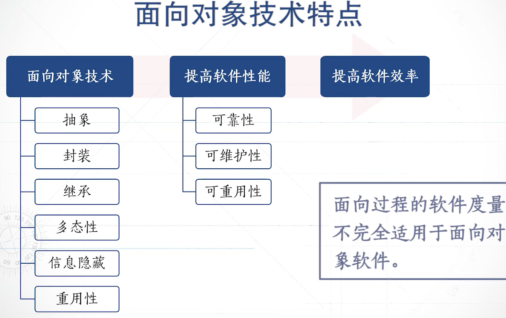
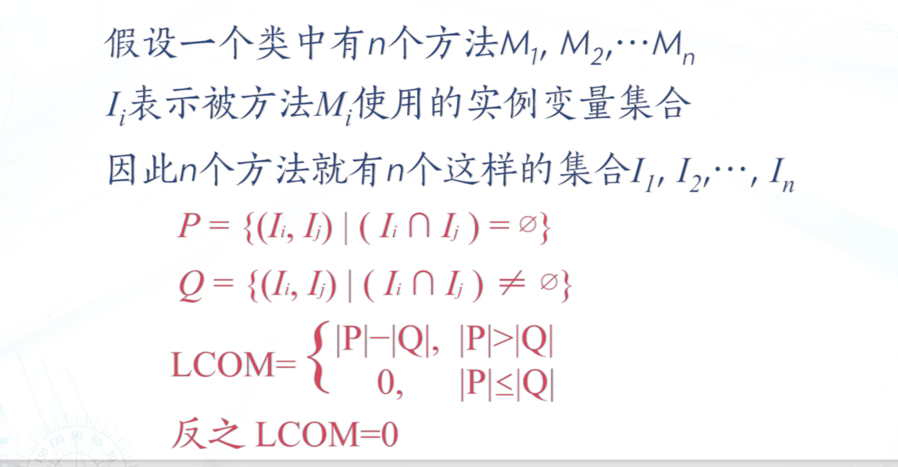

# 详细阶段的度量：

基本控制结构类型：
- 条件
- 循环
- 顺序

控制流结构复杂性的度量：

- 程序流图中圈复杂度计算方法：
  - 圈数加一
  - 节点-边+2
  - 判定节点数+1
- 圈复杂度计算方法的优缺点：
- 优点：
  - 提供了程序代码复杂度的衡量标准
  - 可以衡量一个模块的判定结构的复杂程度，可以定量的描述测试阶段的难度
  - 圈复杂图可以通过自动化工具来进行计算
  - 一般圈复杂度使用详细设计阶段进行计算，使用程序流程图或者控制流图来度量
- 缺点：
  - 没有考虑程序的长度，度量较片面
  - 将程序中的所有判断语句的难易程度看成一致
  - 计算的时候没有考虑嵌套
  - 属于详细设计阶段的度量方法
  - 不太适合数据驱动型的系统进行结构化的度量
  - 不太适合面向对象的软件设计
- 圈复杂度的意义：
  - 若果一个模块的圈复杂度高，那么进行模块分解
  - pld，checkStyle 检测圈复杂度

## 面向对象度量方法的特点：

面向对象技术的特点：
  

- 局部性
- 继承性
- 封装性
- 多态性
- 信息隐藏

常用的面向对象度量方法：
- LK度量方法
- CK度量方法

### LK度量方法：
面向对象软件进行度量的方法：

四个度量点：
1. 类规模度量CS 类的属性和方法越多，类的规模越大 详细设计阶段，避免过大的类
2. 方法重写数NOO 重写父类方法的数量 原因可能是父类没有抽象出公共类的特征
3. 增加方法数量NOA NOA越大，说明父类的方法不能够完全表达子类的行为特征 继承深度约深，
4. 特征化指数SI 用来度量每一个子类在类图设计中的特征化等级，属于间接测量的综合属性。

### CK度量方法：

六个度量点：

- 类的加权方法数WMC（weighted Methods per Class)
  - 是对类的规模与类复杂度的度量
  - 类中的方法复杂度之和
  - 当认为每个方法的复杂度相同时 WMC = 方法数
  - 子类在计算WMC时只计算子类本身的方法数
  - 低复杂度的方法可以忽略不计火设置为较小的值
  - 意义：度量类的规模与复杂度
    - 方法数量多的类可能是面向特殊应用而设计的，这种类的可重用性不高
    - 父类的WMC值越大，对子类的潜在影响就越大
- 类的响应数量RFC：是对类复杂性以及类之间耦合度对一种度量
  - 是类的响应数量，计算一个类的对象对接受的消息进行响应的方法集合的数目

  - **也就是说RFC也就是计算一个类中所以方法以及被该类中方法调用的其他类的方法的总数**
- 继承树的深度DIT
  - 计算某个类在继承树中的深度，从最开始的父类开始，并且第一个父类的深度为0
  - 意义：
    - 越大，说明深度越深，越难预测类的行为
    - 软件的类设计中继承层次多，体现类软件具备较好的重用性，表明系统设计复杂
    - 一般继承层次不超过6
- 子类数量NOC (number of child)：计算一个父类拥有多少个直接继承的子类
  - 意义：
    - 表示父类的对于子类的影响程度，NOC越大对子类影响程度越大
    - 越大，也表明系统设计有较好对重用性
    - NOC越大，说明父类拥有较多对子类，测试的时候，也应该对父类进行更多更强的测试。
- 对象间的耦合度CBO：用来计算一个类与其他类之间的耦合性
  - 在这个CBO中不把父类子类之间的继承关系，看作耦合关系，有几个这样的关系，就算几
  - 意义：
    - CBO越大，越不利于重用
    - 尽量使CBO小，提高类的封装性
    - 过度耦合的两个类，可以考虑合并成一个类
- 类缺乏内聚性 LCOM(Lack of Cohesion) **考察类的内聚性**
  - 通过类中的属性与方法来衡量类中方法之间的相关性
  - 高内聚要求一个模块承担一个单一职责
  - 一个类是高内聚的则是要求这个类中的方法在相同属性集合上完成单一职责的操作。
 
  - 意义：
    - 缺乏内聚度反映了类度内聚程度，实际上也就反映了类设计的封装性
    - 若LCOM值过大，则反映类设计存在缺陷，要考虑是否要讲类中的方法进行分解。
    - 一般来说，方法数多的类，它的LCOM的值也容易更大
    - 也有指出使用类聚缺乏度/方法数来衡量
  
LCOM 越小越好
